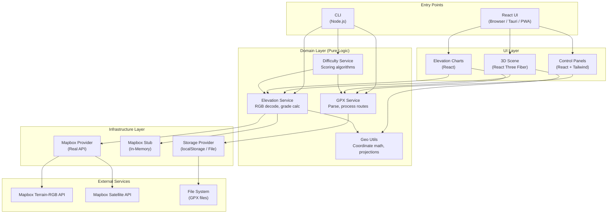

# System Architecture Diagram

## Key Principles

1. **Domain layer is pure** — no IO, no side effects, fully testable
2. **Infrastructure is swappable** — real Mapbox or in-memory stub via provider pattern
3. **Entry points are thin** — UI and CLI both delegate to domain layer
4. **CLI has feature parity** — every domain operation accessible via CLI for agent validation
